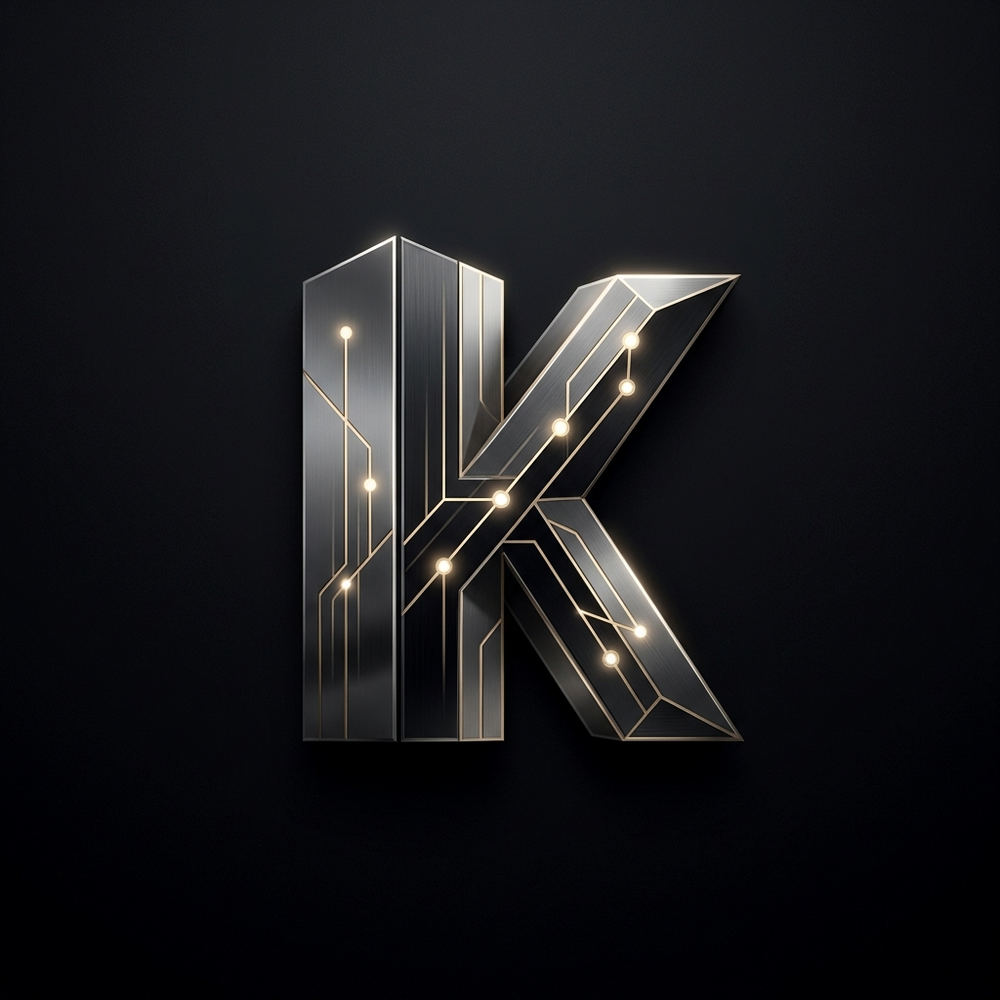
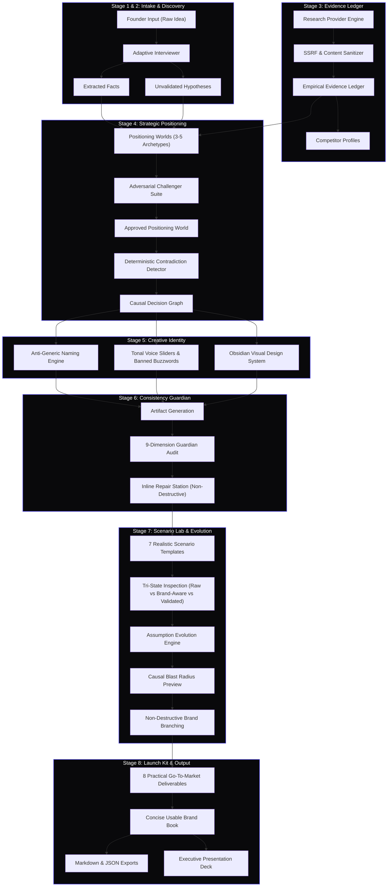

<div align="center">



# KINTRA
### Causal Brand Decision Engine

[](https://nextjs.org/)
[](https://react.dev/)
[](https://www.typescriptlang.org/)
[-orange?style=for-the-badge&logo=google)](https://deepmind.google/technologies/gemini/)
[](https://tavily.com/)
[](https://vitest.dev/)
[](LICENSE)

**Deterministic brand strategy, adversarial challenge, consistency guardian, and causal evolution engine backed by verifiable evidence.**

[Live Demo](http://localhost:3000) · [Architecture Blueprint](#system-architecture) · [Getting Started](#getting-started) · [API Documentation](#api-documentation) · [Presentation Mode](#shareable-presentation-mode)

</div>

---

## 📌 Executive Summary

Most AI branding tools are superficial cliché generators: they ask a founder for three adjectives, hallucinate generic buzzwords (*"supercharge"*, *"revolutionary"*, *"magic AI"*), and output marketing fluff with zero strategic conviction, evidence, or causal memory.

**KINTRA** transforms brand building into a stateful, auditable **Causal Decision Graph**. 

Instead of guessing, KINTRA:
1. **Unpacks Founder Intent**: Extracts verifiable invariants, isolates unvalidated hypotheses, and identifies high-value strategic unknowns.
2. **Grounds in Empirical Evidence**: Crawls market telemetry with built-in SSRF protection and sanitization, generating an evidence ledger with source confidence scores.
3. **Explores Divergent Strategic Worlds**: Synthesizes 3–5 distinct positioning archetypes with explicit tradeoffs (**what we emphasize vs. what we sacrifice**).
4. **Applies Adversarial Pressure**: Challenges assumptions using four specialized evaluators (*Strategist*, *Contrarian*, *Audience Advocate*, *Competitive Challenger*).
5. **Enforces Independent Validation**: Audits every artifact across 9 independent dimensions via the **Consistency Guardian** without collapsing into a fake composite score.
6. **Simulates Real Scenarios**: Stresstests the brand in realistic operational scenarios, providing side-by-side **Tri-State Comparisons** (*Raw* vs. *Brand-Aware* vs. *Validated Final*).
7. **Models Blast Radius & Brand Branching**: When foundational assumptions evolve, KINTRA traces downstream dependencies to preview which decisions remain valid and which require revision, never silently destroying prior work.

---

## 🏗️ System Architecture



---

## ⚡ The 8 Operational Stages

| Stage | Name | Key Functionality | Output Artifacts |
| :--- | :--- | :--- | :--- |
| **01** | **Raw Intake** | Ingests founder vision, problem framing, and initial constraints. | `ExtractedFact[]`, `Hypothesis[]` |
| **02** | **Adaptive Discovery** | Asks high-value unknown questions; explains *why* each question matters. | `AdaptiveInterviewState`, `IdeaBrief` |
| **03** | **Evidence Ledger** | Empirically investigates market competitors with SSRF safety & confidence ranking. | `MarketLandscape`, `EvidenceRecord[]` |
| **04** | **Positioning Worlds** | Creates 3–5 strategic worlds with adversarial stress testing and explicit sacrifices. | `PositioningWorld[]`, `DecisionGraph` |
| **05** | **Creative Identity** | Generates naming territories, pronunciation guides, voice sliders, and visual tokens. | `CreativeIdentity`, `VoiceSystem` |
| **06** | **Consistency Guardian** | Audits deliverables across 9 independent dimensions with structured causal repairs. | `ValidationReport`, `BrandArtifact[]` |
| **07** | **Scenario Lab & Evolution**| Stress-tests 7 realistic scenarios (Tri-State comparison) & models assumption blast radius. | `ScenarioArtifact[]`, `BrandBranch[]` |
| **08** | **Launch Kit & Brand Book** | Generates 8 launch deliverables, usable Brand Book, `.md`/`.json` exports & presentation deck. | `LaunchKit`, `BrandGuidelines` |

---

## 🛡️ The Consistency Guardian: 9 Independent Dimensions

KINTRA rejects "magical composite brand scores". Every artifact is audited across 9 independent, unbundled dimensions:

1. **Strategic Alignment**: Does the copy reflect the approved positioning thesis and explicit sacrifice?
2. **Audience Alignment**: Is the vocabulary, tone, and depth calibrated for the primary buyer persona?
3. **Voice Alignment**: Does the sentence cadence match the tonal sliders (precision, warmth, authority, energy)?
4. **Message Alignment**: Does it reinforce the core message and verifiable proof points?
5. **Visual Alignment**: Do layout density, geometry style, and color tokens adhere to brand guidelines?
6. **Distinctiveness**: Does the copy avoid generic startup clichés that a competitor could say?
7. **Unsupported Claims**: Does the copy make absolute promises (*"100% bug-free"*, *"instant"*) that cannot be verified?
8. **Contradiction Risk**: Does this copy contradict decisions previously locked in the Decision Graph?
9. **Brand-Rule Violations**: Are any strictly forbidden buzzwords (*"supercharge"*, *"copilot"*, *"magic AI"*) detected?

---

## 🧪 Scenario Lab: Tri-State Comparative Inspection

Users can stress-test how the brand performs under pressure across 7 realistic templates:
- `website_launch` · `social_announcement` · `onboarding_screen` · `sales_email` · `investor_pitch` · `advertisement` · `support_response`

For every scenario, KINTRA renders a side-by-side **Tri-State Comparison**:

```
┌───────────────────────────┬───────────────────────────┬───────────────────────────┐
│     RAW GENERATION        │   BRAND-AWARE GENERATION  │      VALIDATED FINAL      │
│  (Ungrounded LLM Clichés) │    (Strategy & Voice)     │ (Consistency Guardian 100%)│
├───────────────────────────┼───────────────────────────┼───────────────────────────┤
│ "Supercharge your team    │ "Deterministic pull       │ "Deterministic pull       │
│ with the 10x magical AI   │ request verification      │ request verification with │
│ copilot that guarantees   │ with AST diff analysis    │ zero code egress. Inspect │
│ bug-free code forever!"   │ before merge."            │ local AST diff telemetry."│
│                           │                           │                           │
│ ✕ Banned marketing hype   │ ✓ Aligned with Purist     │ ✓ 9/9 Dimensions Passed   │
│ ✕ Absolute guarantee      │ ✓ Mentions AST mechanism  │ ✓ Zero Banned Words       │
│ ✕ Zero technical depth    │ ✓ Calibrated for Dev Lead │ ✓ Lineage Preserved       │
└───────────────────────────┴───────────────────────────┴───────────────────────────┘
```

---

## 🚀 Dual-Engine AI Architecture

KINTRA features a production-ready dual-engine architecture:

```
                  ┌──────────────────────────────┐
                  │ Does .env.local have a key?   │
                  └──────────────┬───────────────┘
                                 │
                 YES ────────────┴──────────── NO
                  │                             │
                  ▼                             ▼
       [ GeminiProvider ]              [ MockAIProvider ]
    • Real Google GenAI SDK          • Deterministic fixtures
    • Live gemini-3.8-flash          • Zero token / quota cost
    • Live structured JSON           • Instant test suite (5s)
    • Dynamic strategic reasoning    • Zero setup for judges/reviewers
```

- **Production Mode**: When `GEMINI_API_KEY` is provided, KINTRA invokes Google's `gemini-2.5-flash` or `gemini-3.8-flash` with strict JSON schema enforcement via `@google/genai` and automated high-demand failover. When `TAVILY_API_KEY` is configured, KINTRA conducts live web research and competitor crawling via the Tavily Search API.
- **Demo / Offline Mode**: When running without credentials or in CI, KINTRA executes deterministic fixtures instantly with zero latency and zero billing cost.

---

## 💻 Tech Stack

| Layer | Technology | Purpose |
| :--- | :--- | :--- |
| **Framework** | [Next.js 15.1.7](https://nextjs.org/) (App Router) | High-performance React SSR/SSG and server routes |
| **Runtime** | [React 19](https://react.dev/) + [TypeScript 5](https://www.typescriptlang.org/) | Strict type-safe UI components and domain modeling |
| **AI Integration** | [@google/genai](https://www.npmjs.com/package/@google/genai) | Gemini 2.5 / 3.8 Flash structured output synthesis with auto-failover |
| **Market Research** | [Tavily Search API](https://tavily.com/) | Real-time competitor crawling & market landscape evidence ledger |
| **State Store** | [Zustand 5](https://github.com/pmndrs/zustand) | Client-side persistent reactive brand state & snapshotting |
| **Validation** | [Zod 3](https://zod.dev/) | Strict runtime schema enforcement for all domain types |
| **Styling** | [Tailwind CSS 3](https://tailwindcss.com/) | Dark obsidian terminal aesthetic with WCAG AA compliance |
| **Icons** | [Lucide React](https://lucide.dev/) | Consistent, accessible iconography |
| **Testing** | [Vitest 5](https://vitest.dev/) | Blazing fast unit and end-to-end acceptance test execution |

---

## 📦 Getting Started

### Prerequisites
- **Node.js**: v18.18+ or v20+
- **Package Manager**: `npm`, `pnpm`, or `yarn`

### Installation

1. **Clone the repository**:
   ```bash
   git clone https://github.com/Tejas3479/kintra.git
   cd kintra
   ```

2. **Install dependencies**:
   ```bash
   npm install
   ```

3. **Configure Environment Variables** (Optional):
   ```bash
   cp .env.example .env.local
   ```
   Add your Gemini and Tavily API Keys if you wish to run live inference and live market research:
   ```env
   # .env.local (Git-ignored)
   GEMINI_API_KEY=your_google_gemini_api_key
   GOOGLE_API_KEY=your_google_gemini_api_key
   GEMINI_MODEL=gemini-2.5-flash
   TAVILY_API_KEY=your_tavily_search_api_key
   NEXT_PUBLIC_DEMO_MODE=false
   DEMO_MODE=false
   ```
   *(If unset, KINTRA runs in complete offline mode with realistic deterministic fixtures).*

4. **Start the development server**:
   ```bash
   npm run dev
   ```
   Open **[http://localhost:3000](http://localhost:3000)** in your browser.

---

## 🧪 Testing & Verification

KINTRA includes a test suite covering domain schemas, contradiction detection, SSRF defenses, consistency auditing, and end-to-end lifecycles:

```bash
# Run all 16 test suites (155 tests)
npm test

# Run production build & type checks
npm run build
```

```
Test Files  16 passed (16)
     Tests  155 passed (155)
  Duration  ~5.5s
Routes      12/12 compiled cleanly (0 errors)
```

---

## 🔌 API Documentation

KINTRA exposes modular REST API endpoints under `/api`:

| Method | Endpoint | Request Action | Description |
| :--- | :--- | :--- | :--- |
| `POST` | `/api/discovery` | `extract_facts`, `next_question`, `synthesize_brief` | Adaptive interview & hypothesis extraction |
| `POST` | `/api/research` | `query_market` | SSRF-safe competitor crawling & evidence ledger |
| `POST` | `/api/strategy` | `generate_worlds`, `audit_contradictions` | Strategic positioning worlds & adversarial review |
| `POST` | `/api/identity` | `generate_identity`, `generate_visual` | Anti-generic naming, voice sliders & visual assets |
| `POST` | `/api/guardian` | `validate_artifact`, `apply_repair` | 9-dimension auditing and non-destructive repairs |
| `POST` | `/api/evolution` | `analyze_impact`, `compare_branches` | Causal blast radius calculation & branch diffing |
| `POST` | `/api/launch-kit` | `generate`, `export_markdown`, `export_json` | 8 deliverables, brand book & machine-readable export |

---

## 🖥️ Shareable Presentation Mode

KINTRA includes a built-in fullscreen presentation deck for founder reviews, team alignment, and hackathon judging:

- **Launch**: Click **"Presentation Mode"** in the top navigation or in Stage 8.
- **Controls**:
  - `→` / `Space` / `PageDown`: Next slide
  - `←` / `PageUp`: Previous slide
  - `Esc`: Close presentation deck
- **Slides**:
  1. *Executive Overview & 30-Second Elevator Pitch*
  2. *Strategic Thesis & The Explicit Sacrifice*
  3. *Brand Personality & Tonal Voice System*
  4. *Visual Identity & Typography Tokens*
  5. *Editorial Do and Don't Matrix*
  6. *Generated Launch Deliverables Showcase*
  7. *Deterministic Governance Ledger & Audit Fingerprint*

---

## 📄 License

This project is licensed under the [MIT License](LICENSE).

---

<div align="center">
  <sub>Built for the Inkloom Challenge 2026. Governed by the KINTRA Causal Decision Model.</sub>
</div>
